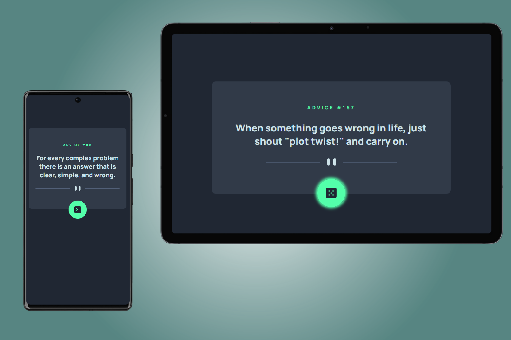

# Frontend Mentor - Advice generator app solution

This is a solution to the [Advice generator app challenge on Frontend Mentor](https://www.frontendmentor.io/challenges/advice-generator-app-QdUG-13db). Frontend Mentor challenges help you improve your coding skills by building realistic projects.

## Table of contents

- [Overview](#overview)
  - [The challenge](#the-challenge)
  - [Screenshot](#screenshot)
  - [Links](#links)
- [My process](#my-process)
  - [Built with](#built-with)
  - [What I learned](#what-i-learned)
  - [Continued development](#continued-development)
  - [Useful resources](#useful-resources)
- [Author](#author)
- [Acknowledgments](#acknowledgments)

**Note: Delete this note and update the table of contents based on what sections you keep.**

## Overview

### The challenge

Users should be able to:

- View the optimal layout for the app depending on their device's screen size
- See hover states for all interactive elements on the page
- Generate a new piece of advice by clicking the dice icon

### Screenshot



### Links

- Solution URL: (https://github.com/hannahf86/adviceGeneratorApp)
- Live Site URL: (https://your-live-site-url.com)

## My process

- I chose to create the app in React and Vite for a few reasons. Firstly, I wanted more practice with APIs in React. 
Secondly, I chose Vite because it is incredibly fast for SPAs due to its HMR performance. I also find the boilerplate 
code not excessive, as it can be with other tools or frameworks, such as Next.js

- My first step was to get the UI up and running as quickly as possible. This included the hover state for the dice SVG.
I used flexbox to achieve the layout set out by the designers, beginning with mobile first

- Next, I created the functions and variables in order to get the API to work. 

- Finally, I tidied up the CSS and made the design responsive for tablet and desktop screen sizes

### Built with

- Semantic HTML5 markup
- CSS custom properties
- Flexbox
- CSS Grid
- Mobile-first workflow
- [React](https://reactjs.org/) - JS library
- [Vite](https://vitejs.dev/) - Frontend development tool

### What I learned

I reinforced my knowledge of using simple APIs and CSS.

I initially set out using fetch/then/catch to keep the code clean, but it wasn't working. In hindsight, I believe I was 
making some careless errors, but my goal for this project was to be fast, so I decided I would use another project to revise 
fetch/then/catch, and just use async/await for this one. However, this meant I had to add a couple more steps than was perhaps 
necessary. Something to work on in the future for sure.

I was particularly pleased with the position of the dice SVG, as it required a combination of relative/absolute positioning, 
and utilising the Z axis. I was also happy I managed to achieve the desired result for the hover effect.

```CSS
.dice:hover {
  box-shadow: 0 0 0.5em 0.25em var(--accent-color)
}``` 

Working with the designer's Figma file beside me was incredibly useful! It was a very useful exercise to be able to look at the exact 
numbers used, and translate them into code. Something I particularly enjoyed was being able to see the exact sizes and measurements of
the design, and translate them into em measurements to keep the design consistent and responsive.


If you want more help with writing markdown, we'd recommend checking out [The Markdown Guide](https://www.markdownguide.org/) to learn more.

### Continued development

Further development could include including user authentication and being able to save your favourite quotes. There could also be scope for setting times
of day for certain quotes, or providing tags and themes for different situations.

## Author

- Website - [Hannah Feehan](https://www.hannahfeehan.com)
- Twitter - [@hannahfdev](https://www.twitter.com/hannahfdev)

**Note: Delete this note and add/remove/edit lines above based on what links you'd like to share.**

## Acknowledgments

Massive thank you to Joe Abell for helping with Firefox "aggressively" caching the API!
